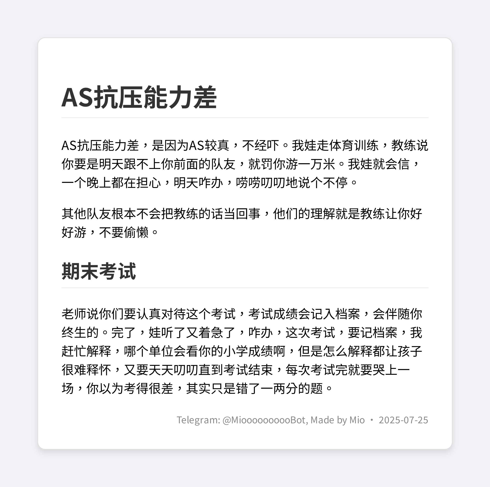

# MioBot

## Overview

MioBot 是一个异步 Telegram 机器人，提供以下功能：  
- 将内联 Markdown 或纯文本转换为图片。  
- 支持上传 `.txt` / `.md` 文件并转成图片。  
- 识别消息里的 YouTube 以及 Bilibili 链接并下载 720p H.264 MP4。  
- 在群聊中根据最近上下文与随机概率（或被直接回复时必定）的一位“猫娘”Bot。  
- 使用 SQLite 保存消息，每次API Call使用最近最多 100 条群消息，供上下文生成回复。  
- 基于 Azure OpenAI（自定义部署模型）完成文本格式化与对话生成。  

核心流程：  
1. `/md2jpg` 或 `/text2jpg` 指令解析内容 →（可选：调用 LLM 转 Markdown）→ Playwright 渲染 HTML → 截图 → Pillow 转换格式。  
2. 群消息写入 SQLite → 条件触发 → LLM 决策 + 生成 JSON → 发送简短猫娘风格回复。  
3. 发现 YouTube 链接 → yt-dlp + ffmpeg 合成 mp4 → 回传。  

特点：轻量、模块化、异步、易扩展。适合需要内容可视化 + 轻社交陪伴的中文/多语言群。

---

Async Telegram bot that:
- Converts inline Markdown or plain text to themed images (formal code or cute anime).
- Converts uploaded `.txt` / `.md` files to images.
- Downloads YouTube videos (up to 720p AVC) on link detection.
- Occasionally (or when directly addressed / replied to) participates in group chats in a cat‑girl persona using Azure OpenAI.
- Persists recent group chat history in SQLite for contextual replies.

---

## Catgirl Persona

You can edit the information in `info.txt` to customize the bot's background knowledge. Seperate each piece of information with a new line. The bot will use this information to generate replies.

## Features

### 1. Markdown / Text → Image  
Commands (content wrapped by `,,,` sent in one message):
```
/md2jpg ,,,# Title
Some *markdown* here,,,
/text2jpg ,,,Some plain unformatted text here,,,
```
Plain text is first converted to Markdown via Azure OpenAI using [`app.text2md.plain_text_to_markdown`](app/text2md.py), then rendered to HTML + screenshot via Chromium (Playwright) using [`app.md2jpg.md_to_image`](app/md2jpg.py).

Sample Image:


More examples in [output/](output/).


### 2. File Conversion  
Upload a `.txt` (will be converted first) or `.md` (used as-is). Bot returns an image.

### 3. YouTube and Bilibili Video Download  
Paste (no command needed) a YouTube URL (supports `watch`, `shorts`, `youtu.be`, etc.) and a Bilibili URL (supports `bilibili.com` and `b23.tv`).
Handled in [`main.handle_all_text`](main.py) which calls:
- [`app.youtube_dl.get_video_title`](app/youtube_dl.py)
- [`app.youtube_dl.download_video_720p_h264`](app/youtube_dl.py)

### 4. Contextual Group Replies  
Stores messages in SQLite via:
- [`app.database.add_message`](app/database.py)
- [`app.database.get_messages`](app/database.py)  
Decision + generation handled by [`app.reply2message.should_reply_and_generate`](app/reply2message.py) using Azure OpenAI (JSON-mode). Logic:
- Always reply if user directly replies to bot.
- Otherwise random sampling gate (1 in 5) to reduce noise.
- Uses last N (100) messages from DB.

### 5. Themed Rendering  
Themes: `formal_code` (default) or `cute_anime` (see CSS in [`app.md2jpg.md_to_image`](app/md2jpg.py)). Multi-format support: jpg / webp / avif / png.

---

## Architecture Overview

| Concern | File |
|---------|------|
| Entry point & handlers | [main.py](main.py) |
| Markdown → Image | [app/md2jpg.py](app/md2jpg.py) |
| Plain Text → Markdown (LLM) | [app/text2md.py](app/text2md.py) |
| YouTube download | [app/youtube_dl.py](app/youtube_dl.py) |
| Reply decision + generation | [app/reply2message.py](app/reply2message.py) |
| SQLite persistence | [app/database.py](app/database.py) |
| Secrets template | [secret.py.template](secret.py.template) |

Key symbols:
- [`app.md2jpg.md_to_image`](app/md2jpg.py)
- [`app.text2md.plain_text_to_markdown`](app/text2md.py)
- [`app.youtube_dl.download_video_720p_h264`](app/youtube_dl.py)
- [`app.youtube_dl.get_video_title`](app/youtube_dl.py)
- [`app.reply2message.should_reply_and_generate`](app/reply2message.py)
- [`app.database.init_db`](app/database.py)
- [`app.database.add_message`](app/database.py)
- [`app.database.get_messages`](app/database.py)

---

## Installation

1. Python 3.11+ (pycache indicates 3.13 compatible).
2. Clone repository.
3. Create virtual environment:
   ```
   python -m venv .venv
   source .venv/bin/activate
   ```
4. Install Python dependencies:
   ```
   bash pip_install.sh
   ```
5. Install Playwright browser:
   ```
   playwright install chromium
   ```
6. Ensure FFmpeg available (for yt-dlp post-processing):
   ```
   # Debian/Ubuntu
   sudo apt-get update && sudo apt-get install -y ffmpeg
   ```
7. Copy secrets:
   ```
   cp secret.py.template secret.py
   ```
   Fill Azure + Telegram values in [`secret.py`](secret.py.template).

---

## Azure OpenAI Configuration

Set deployment name in [main.py](main.py):
```
AZURE_OPENAI_DEPLOYMENT_NAME = "your-deployment"
```
API details passed from [`secret.pass_secret_variables`](secret.py.template) into runtime constants in [main.py](main.py).

---

## Running

```
python main.py
```

On first run SQLite file `message_history.db` created by [`app.database.init_db`](app/database.py). Output images/videos stored temporarily in `output/`.

---

## Command & Interaction Summary

| Action | How |
|--------|-----|
| Start | `/start` |
| Markdown to image | `/md2jpg ,,,...markdown...,,,` |
| Plain text to image | `/text2jpg ,,,...plain text...,,,` |
| File to image | Upload `.txt` / `.md` |
| YouTube download | Paste link |
| Group playful reply | Bot auto-decides (see logic) |

Notes:
- Wrap payload exactly with leading and trailing `,,,`.
- Bot deletes original YouTube link message after sending video.

---

## Message History & Context

SQLite keeps last 100 messages per chat (trim done in [`app.database.add_message`](app/database.py)). Retrieval ordered ascending for model consumption in [`app.database.get_messages`](app/database.py).

---

## Rendering Pipeline (Text → Image)

1. (Optional) LLM formatting: [`app.text2md.plain_text_to_markdown`](app/text2md.py)
2. Markdown → HTML (markdown2).
3. HTML → headless Chromium screenshot (Playwright) in [`app.md2jpg.md_to_image`](app/md2jpg.py).
4. Convert PNG → target format via Pillow.

---

## Error Handling

- Each handler wraps generation / download with try–except and reports concise Telegram error.
- Video / image temporary artifacts removed after send.
- LLM / API failures logged; reply generation returns None gracefully.

---

## Extending

Ideas:
- Add rate limiting per user.
- Add admin-only commands for purging DB.
- Add more rendering themes.
- Add inline query support.
- Cache YouTube titles.

---

## Security Notes

- Do not commit `secret.py`.
- Current design keeps API keys only in memory.
- Consider Dockerizing & injecting secrets via environment variables instead of Python file.

---

## Troubleshooting

| Symptom | Cause | Fix |
|---------|-------|-----|
| Playwright error | Browser not installed | Run `playwright install chromium` |
| Video fails | Missing ffmpeg | Install ffmpeg |
| No AI replies | Deployment name mismatch | Check `AZURE_OPENAI_DEPLOYMENT_NAME` |
| Unicode issues | Font fallback missing | Add Noto fonts system-wide if needed |

---

## License

GNU General Public License v3.0	

This project is licensed under the GNU GPLv3. See [LICENSE](LICENSE) for details.

---

## Quick Demo Snippet

Markdown request:
```
/md2jpg ,,,# Title
Some code:

```python
print("Hello")
```
,,,
```

Plain text request:
```
/text2jpg ,,,This is raw text that should become markdown.,,,
```

---

## Dependency Reference

See [pip_install.sh](pip_install.sh). Core libs: python-telegram-bot (async), markdown2, playwright, Pillow, yt-dlp, openai (Azure), aiosqlite, requests, bs4.

---

## Disclaimer

AI replies are probabilistic; moderate in large groups.