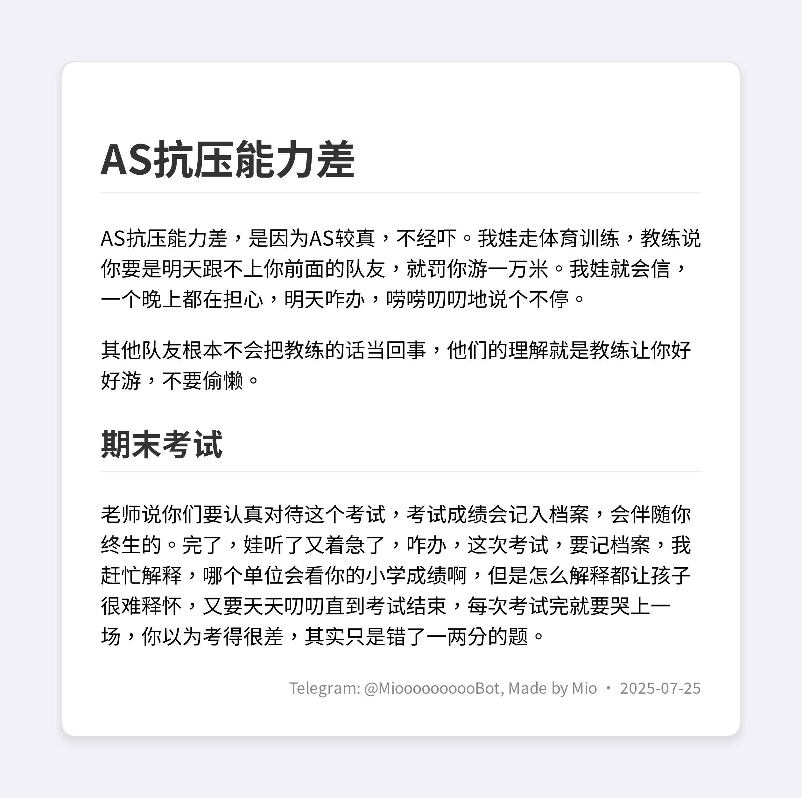

# MioBot

## Overview

MioBot 是一个异步 Telegram 机器人，提供以下功能：  
- 将内联 Markdown 或纯文本转换为图片。  
- 支持上传 `.txt` / `.md` 文件并转成图片。  
- 识别消息里的 YouTube 以及 Bilibili 链接并下载 720p H.264 MP4。  
- 在群聊中根据最近上下文与随机概率（或被直接回复时必定）的一位"猫娘"Bot，支持图片理解。  
- 使用 SQLite 保存消息，并通过向量嵌入（RAG）检索相关历史消息，供上下文生成回复。  
- 支持多 LLM 后端：Azure OpenAI、Ark（Volces/DeepSeek）、Ollama（本地）。  
- `/crypto` 命令实时获取加密货币价格与 Kamino Finance Allez SOL/USDC APR 信息。  
- `/med2jpg` 命令将自然语言描述转换为中文处方笺图片（需要 LaTeX 环境）。  

核心流程：  
1. `/md2jpg` 或 `/text2jpg` 指令解析内容 →（可选：调用 LLM 转 Markdown）→ Playwright 渲染 HTML → 截图 → Pillow 转换格式。  
2. 群消息写入 SQLite + 生成向量嵌入 → 条件触发 → LLM 决策 + 生成 JSON → 发送简短猫娘风格回复。  
3. 发现 YouTube/Bilibili 链接 → yt-dlp + ffmpeg 合成 mp4 → 回传。  
4. `/med2jpg` → LLM 生成处方 JSON → LaTeX 编译 → PDF → JPG 回传。  

特点：轻量、模块化、异步、易扩展。适合需要内容可视化 + 轻社交陪伴的中文/多语言群。

---

Async Telegram bot that:
- Converts inline Markdown or plain text to themed images (formal code or cute anime).
- Converts uploaded `.txt` / `.md` files to images.
- Downloads YouTube and Bilibili videos (up to 720p AVC) on link detection.
- Occasionally (or when directly addressed / replied to) participates in group chats in a cat-girl persona using a configurable LLM backend.
- Understands group photos by extracting text and visual descriptions via a vision model.
- Persists recent group chat history in SQLite with vector-embedding-based RAG retrieval for contextual replies.
- Reports live cryptocurrency prices and DeFi APR data via `/crypto`.
- Generates traditional Chinese prescription (处方笺) images from natural language via `/med2jpg`.

---

## Catgirl Persona

You can edit the information in `info.txt` to customize the bot's background knowledge. Copy `info.txt.template` to `info.txt` and add one piece of information per line. The bot will use this information to generate replies.

## Features

### 1. Markdown / Text → Image  
Commands (content wrapped by `,,,` sent in one message):
```
/md2jpg ,,,# Title
Some *markdown* here,,,
/text2jpg ,,,Some plain unformatted text here,,,
```
Plain text is first converted to Markdown via the configured LLM using [`app.text2md.plain_text_to_markdown`](app/text2md.py), then rendered to HTML + screenshot via Chromium (Playwright) using [`app.md2jpg.md_to_image`](app/md2jpg.py).

Sample Image:


More examples in [output/](output/).


### 2. File Conversion  
Upload a `.txt` (will be converted first) or `.md` (used as-is). Bot returns an image.

### 3. YouTube and Bilibili Video Download  
Paste (no command needed) a YouTube URL (supports `watch`, `shorts`, `youtu.be`, etc.) or a Bilibili URL (supports `bilibili.com/video/`, `b23.tv`).
Handled in [`main.handle_text_for_youtube_or_group`](main.py) which calls:
- [`app.youtube_dl.get_video_title`](app/youtube_dl.py)
- [`app.youtube_dl.download_video_720p_h264`](app/youtube_dl.py)

### 4. Contextual Group Replies  
Stores messages in SQLite via:
- [`app.database.add_message`](app/database.py)
- [`app.database.get_messages`](app/database.py)

Decision + generation handled by [`app.reply2message.should_reply_and_generate`](app/reply2message.py) (JSON-mode LLM). Logic:
- Always reply if user directly replies to bot.
- Otherwise random sampling gate (1 in 5) to reduce noise.
- Context is built from the last 20 recent messages (`RAG_RECENT_N`) plus up to 12 semantically relevant messages (`RAG_TOP_K`) retrieved via vector search.

### 5. Group Photo Understanding  
Photos sent in group chats are processed by [`app.image2text.image_to_text`](app/image2text.py) using the Ark vision model (requires `ARK_API_KEY`). The extracted text and caption are then passed through the standard AI group reply pipeline.

### 6. Themed Rendering  
Themes: `formal_code` (default) or `cute_anime` (see CSS in [`app.md2jpg.md_to_image`](app/md2jpg.py)). Multi-format support: jpg / webp / avif / png.

### 7. Cryptocurrency Prices (`/crypto`)  
Fetches real-time prices for SOL, USDC, BTC, ETH, USDT from Coinbase, plus Allez SOL and Allez USDC APR data from Kamino Finance. Implemented in [`app/cryto.py`](app/cryto.py).

### 8. Medical Prescription Generator (`/med2jpg`)  
Converts a natural-language description into a traditional Chinese prescription (处方笺) image. The flow is:
1. LLM converts the prompt to structured prescription JSON ([`app.med.generate_med`](app/med.py)).
2. LaTeX macros and medicine blocks are generated from the JSON.
3. `xelatex` compiles the `.tex` files into a PDF.
4. `pypdfium2` converts the first PDF page to a JPG.

> **Note:** This feature requires a full LaTeX installation with Chinese support — see [Installation](#installation).

---

## Architecture Overview

| Concern | File |
|---------|------|
| Entry point & handlers | [main.py](main.py) |
| Markdown → Image | [app/md2jpg.py](app/md2jpg.py) |
| Plain Text → Markdown (LLM) | [app/text2md.py](app/text2md.py) |
| YouTube / Bilibili download | [app/youtube_dl.py](app/youtube_dl.py) |
| Reply decision + generation | [app/reply2message.py](app/reply2message.py) |
| SQLite persistence + RAG retrieval | [app/database.py](app/database.py) |
| Vector embeddings (RAG) | [app/rag_embeddings.py](app/rag_embeddings.py) |
| Multi-provider LLM abstraction | [app/ai_model.py](app/ai_model.py) |
| Image → Text (vision) | [app/image2text.py](app/image2text.py) |
| Cryptocurrency prices & APR | [app/cryto.py](app/cryto.py) |
| Medical prescription generator | [app/med.py](app/med.py) |
| Alternative sync chat client | [app/chat.py](app/chat.py) |
| Secrets template | [secret.py.template](secret.py.template) |

Key symbols:
- [`app.md2jpg.md_to_image`](app/md2jpg.py)
- [`app.text2md.plain_text_to_markdown`](app/text2md.py)
- [`app.youtube_dl.download_video_720p_h264`](app/youtube_dl.py)
- [`app.youtube_dl.get_video_title`](app/youtube_dl.py)
- [`app.reply2message.should_reply_and_generate`](app/reply2message.py)
- [`app.database.init_db`](app/database.py)
- [`app.database.add_message`](app/database.py)
- [`app.database.get_messages`](app/database.py)
- [`app.database.get_prompt_context_parts`](app/database.py)
- [`app.ai_model.configure_llm`](app/ai_model.py)
- [`app.ai_model.chat_completion`](app/ai_model.py)
- [`app.image2text.image_to_text`](app/image2text.py)
- [`app.med.generate_med`](app/med.py)
- [`app.med.generate_jpg_from_med_json`](app/med.py)

---

## Installation

1. Python 3.11+ (tested up to 3.13; see [Known Issues](#known-issues) for Python 3.14).
2. Clone repository.
3. Create virtual environment:
   ```
   python -m venv .venv
   source .venv/bin/activate
   ```
4. Install all system and Python dependencies using the provided script:
   ```bash
   bash init.sh
   ```
   This installs: `texlive-full`, `texlive-xetex`, `texlive-latex-extra`, `ffmpeg`, and all Python packages including `python-telegram-bot`, `markdown2`, `playwright`, `Pillow`, `yt-dlp`, `openai`, `aiosqlite`, `numpy`, `fastembed`, `onnxruntime`, `pypdfium2`, and more.

   Alternatively, install Python packages manually:
   ```bash
   pip install python-telegram-bot markdown2 pillow aiofiles aiohttp requests \
       beautifulsoup4 playwright openai aiosqlite yt-dlp pypdfium2 numpy fastembed \
       onnxruntime httpx
   playwright install chromium --with-deps
   ```

   > **Note:** `texlive-full` is only required for `/med2jpg`. `fastembed` / `onnxruntime` are required for vector-based RAG; a hash-based fallback is used automatically if they are unavailable.

5. Copy and fill in secrets:
   ```
   cp secret.py.template secret.py
   ```
   Edit `secret.py` with your Telegram bot token, Azure OpenAI / Ark credentials. See [LLM Configuration](#llm-configuration).

6. Copy and fill in bot background info:
   ```
   cp info.txt.template info.txt
   ```
   Add one fact per line. The bot reads this file at runtime for its persona.

---

## LLM Configuration

MioBot supports three LLM backends, selected via the `LLM_PROVIDER` (or `AI_PROVIDER`) environment variable:

| Provider | `LLM_PROVIDER` value | Required env vars |
|----------|----------------------|-------------------|
| Azure OpenAI | `azure` | `AZURE_OPENAI_ENDPOINT`, `AZURE_OPENAI_API_KEY`, `AZURE_OPENAI_DEPLOYMENT` |
| Ark / Volces (DeepSeek, etc.) | `ark` | `ARK_API_KEY`, `ARK_MODEL` |
| Ollama (local) | `ollama` | `OLLAMA_ENDPOINT`, `OLLAMA_MODEL` |

Provider is also auto-detected from available credentials if `LLM_PROVIDER` is not set (Ark is the fallback default).

The deployment name for Azure can also be set in [main.py](main.py):
```python
AZURE_OPENAI_DEPLOYMENT_NAME = "your-deployment"
```

All credentials are loaded from `secret.py` via `secret.pass_secret_variables()` and then exported as environment variables by `secret.set_environment()`, which is called at bot startup.

---

## Running

```
python main.py
```

On first run SQLite file `message_history.db` is created by [`app.database.init_db`](app/database.py). Output images/videos are stored temporarily in `output/` and deleted after being sent.

---

## Command & Interaction Summary

| Action | How |
|--------|-----|
| Start | `/start` |
| Markdown to image | `/md2jpg ,,,...markdown...,,,` |
| Plain text to image | `/text2jpg ,,,...plain text...,,,` |
| File to image | Upload `.txt` / `.md` |
| YouTube / Bilibili download | Paste link (no command) |
| Cryptocurrency prices & APR | `/crypto` |
| Medical prescription image | `/med2jpg ...natural language description...` |
| Group playful reply | Bot auto-decides (1-in-5 or always when replied to) |
| Group photo | Bot reads image content and may reply |

Notes:
- Wrap `/md2jpg` and `/text2jpg` payload exactly with leading and trailing `,,,`.
- Bot deletes the original YouTube/Bilibili link message after sending the video (requires delete-message permission in groups).
- `/med2jpg` requires `xelatex` and `pypdfium2` to be installed.

---

## Message History & Context

SQLite retains the last **80** messages per chat (`MESSAGE_REVIEW_BACK = 80` in `app/database.py`). When building the LLM context, the pipeline uses:

- **Recent context**: last 20 messages (`RAG_RECENT_N`, configurable via env var).
- **RAG retrieval**: up to 12 semantically relevant past messages (`RAG_TOP_K`, configurable via env var) retrieved via cosine similarity over local vector embeddings.

RAG can be disabled entirely by setting `RAG_ENABLED=0`.

Retrieval uses [`app.rag_embeddings.embed_text`](app/rag_embeddings.py) with `fastembed` (default model: `sentence-transformers/paraphrase-multilingual-MiniLM-L12-v2`) and falls back to a hash-based char-ngram vector if `fastembed` / `onnxruntime` is unavailable.

---

## Rendering Pipeline (Text → Image)

1. (Optional) LLM formatting: [`app.text2md.plain_text_to_markdown`](app/text2md.py)
2. Markdown → HTML (`markdown2`, extras: fenced-code-blocks, tables).
3. HTML → headless Chromium screenshot (Playwright) in [`app.md2jpg.md_to_image`](app/md2jpg.py).
4. Convert PNG → target format via Pillow (JPEG quality 40, WebP quality 40, AVIF quality 40).

---

## Error Handling

- Each handler wraps generation / download with try–except and reports a concise Telegram error message.
- Video / image temporary artifacts are removed after sending (or on failure).
- LLM / API failures are logged; reply generation returns `None` gracefully.
- A global Telegram `Conflict` error handler suppresses duplicate-polling warnings without crashing.

---

## Extending

Ideas:
- Add rate limiting per user.
- Add admin-only commands for purging DB.
- Add more rendering themes.
- Add inline query support.
- Cache YouTube titles.
- Expose `/med2jpg` template fields (doctor name, hospital) as configurable parameters.

---

## Security Notes

- Do not commit `secret.py`.
- Current design keeps API keys only in memory (loaded into environment variables at startup).
- Consider Dockerizing & injecting secrets via environment variables instead of a Python file.
- The `/med2jpg` feature generates realistic-looking medical prescriptions. The LaTeX template includes a `watermark` field; leaving it blank may be inappropriate in some jurisdictions.

---

## Troubleshooting

| Symptom | Cause | Fix |
|---------|-------|-----|
| Playwright error | Browser not installed | Run `playwright install chromium --with-deps` |
| Video download fails | Missing ffmpeg | Install ffmpeg (`sudo apt-get install ffmpeg`) |
| No AI replies | LLM provider misconfigured | Check `LLM_PROVIDER` and corresponding API key / endpoint env vars |
| `/med2jpg` fails | Missing LaTeX or pypdfium2 | Install `texlive-full texlive-xetex` and `pip install pypdfium2` |
| Group photo not processed | Ark vision API not configured | Set `ARK_API_KEY` (image-to-text only works with Ark provider) |
| RAG not working | fastembed unavailable | Install `fastembed onnxruntime`, or set `EMBED_BACKEND=hash` for the fallback |
| Unicode / font issues | Font fallback missing | Add Noto fonts system-wide (`apt-get install fonts-noto`) |
| Bot can't delete YouTube message | Missing permissions | Grant the bot "Delete messages" admin right in the group |

---

## Known Issues

- **Module name typo**: `app/cryto.py` should be `app/crypto.py`. The typo is present in both the file name and the import in `main.py`; changing one requires changing the other.

- **Image-to-text is Ark-only**: [`app/image2text.py`](app/image2text.py) calls the Ark Responses API directly and requires `ARK_API_KEY`. It does not use the multi-provider `app/ai_model.py` abstraction, so group photo understanding is unavailable when running with Azure or Ollama providers.

- **`/med2jpg` has hardcoded template values**: The LaTeX template in [`app/med.py`](app/med.py) hardcodes a doctor name (`孙致连`), a phone number (`176****3888`), and a hospital watermark notice. These are not user-configurable without editing the source.

- **RAG embeddings unavailable on Python 3.14+**: `onnxruntime` wheels may not exist for Python 3.14. In that case `fastembed` cannot be loaded and the bot automatically falls back to a hash-based embedding. This fallback still enables vector search but with lower semantic quality. Set `EMBED_BACKEND=hash` explicitly to opt in to the fallback without error logs.

- **Streaming only supported for Azure**: `app/ai_model.stream_chat_completion` raises `NotImplementedError` for Ark and Ollama providers.

- **Hardcoded Ollama endpoint in template**: `secret.py.template` sets `OLLAMA_ENDPOINT` to a private LAN address (`http://100.69.97.8:11434`). Users running their own Ollama server must change this value in `secret.py`.

- **Bot requires delete-message permission for video links**: When a YouTube or Bilibili link is detected, the bot deletes the original user message after sending the video. If the bot is not an admin with the "Delete messages" right in a group, this step silently fails (the video is still sent).

- **`app/chat.py` is not integrated with the main LLM system**: [`app/chat.py`](app/chat.py) is a standalone synchronous `ChatClient` that talks to Azure only. It is not used anywhere in the main bot flow and is independent of the `app/ai_model.py` provider abstraction.

- **Message history trim vs. context window mismatch**: The database retains 80 messages (`MESSAGE_REVIEW_BACK = 80`) but the LLM prompt only receives the last 20 (`RAG_RECENT_N = 20`) plus up to 12 RAG hits. In very active groups, context may be limited. Both values are tunable via environment variables.

- **`/med2jpg` date defaults**: When the user does not supply a date, the prescription defaults to `2025-10-11`. This hardcoded fallback in [`app/med.py`](app/med.py) may produce prescriptions with outdated dates.

---

## License

GNU General Public License v3.0

This project is licensed under the GNU GPLv3. See [LICENSE](LICENSE) for details.

---

## Quick Demo Snippet

Markdown request:
```
/md2jpg ,,,# Title
Some code:

```python
print("Hello")
```
,,,
```

Plain text request:
```
/text2jpg ,,,This is raw text that should become markdown.,,,
```

Crypto prices:
```
/crypto
```

Prescription image:
```
/med2jpg Patient: Alice, 30F. Diagnosis: anxiety. Prescribe sertraline 50mg.
```

---

## Dependency Reference

See [init.sh](init.sh). Core libs: `python-telegram-bot` (async), `markdown2`, `playwright`, `Pillow`, `yt-dlp`, `openai` (Azure), `aiosqlite`, `httpx`, `numpy`, `fastembed`, `onnxruntime`, `pypdfium2`, `requests`.

---

## Disclaimer

AI replies are probabilistic; moderate in large groups. The `/med2jpg` feature is for demonstration only and should not be used to create real medical documents.
